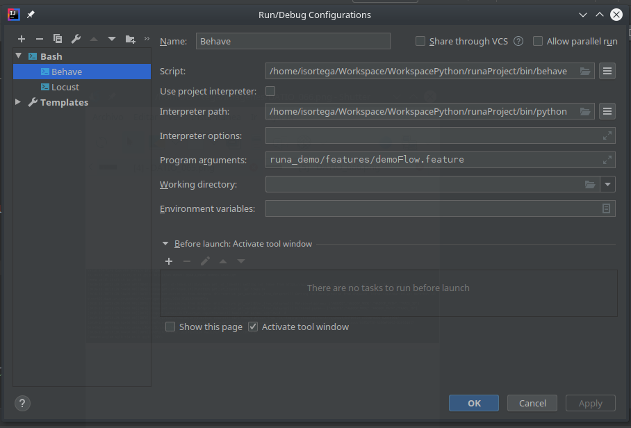
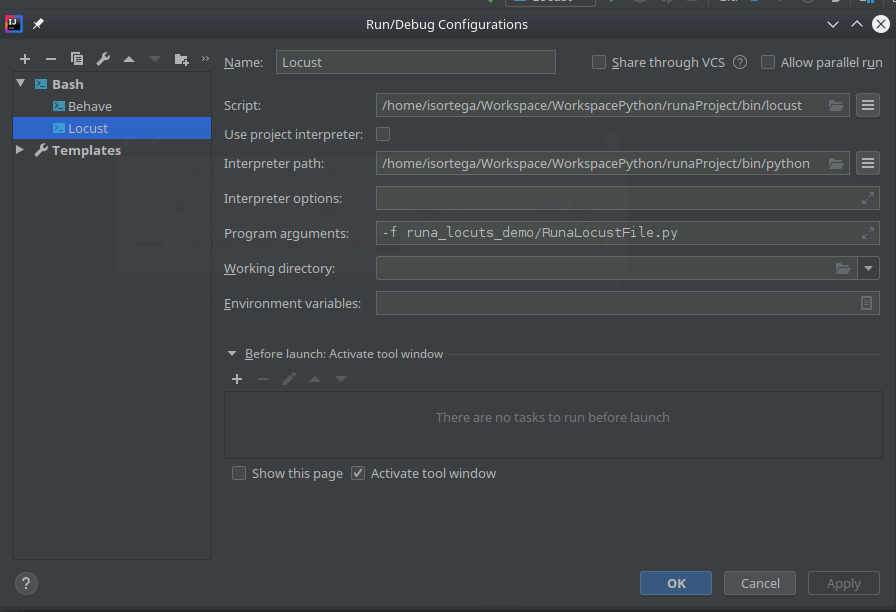

# RUNA_DEMO

Prueba técnica para corroborar los conocimientos de pruebas automatizadas. 
Se implementa el flujo solicitado por Email con behave y python, adicional
se agrega un POC de uso de Locustio consumiendo la API de la plataforma de Runa.

## Instalación  

Se recomienda utilizar entornos virtuales, con los siguientes comandos podemos crear y activar el 
entorno virtual:  
 ```bash
$ virtualenv ~/Workspace/WorkspacePython/runaProject

$ source ~/Workspace/WorkspacePython/runaProject/bin/activate
``` 

El proyecto de Behave se implementó a partir de un template creado con Cookiecutter, utilizando el
del repositorio [cookiecutter-behave](https://github.com/dunossauro/cookiecutter-behave), se sigió 
los siguientes comandos:

```bash 
$ pip install cookiecutter

$ cookiecutter gh:z4r4tu5tr4/cookiecutter-behave

$ pip install behave

$ pip install -r requirements.txt
```

## Ejecución

La ejecución la realicé a través de Intellij, dejo las configuraciones:

* Behave



* Locustio




## Referencia

Dejo los links a sitios que use como referencia para trabajar en la demostración:

* https://selenium-python.readthedocs.io
* https://github.com/crki76/Python-Behave-sample-project/tree/master/features/steps
* https://selenium-python.readthedocs.io/waits.html
* https://jenisys.github.io/behave.example/tutorials/tutorial03.html
* https://github.com/behave/behave.example